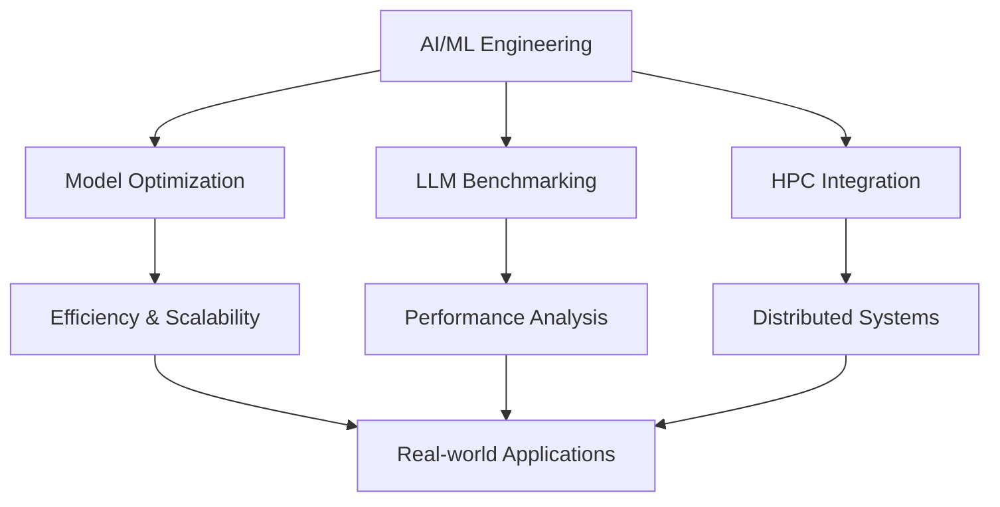

# Hi there! 👋 I'm Ankush Sonawane

  

  
  
  
  
  

---

## 🚀 About Me

  
### 💫 *"Bridging the gap between AI dreams and reality"*

  
  🎯 **HPC + AI/ML Engineer @ CDAC** | 🏙️ **Pune, India**
  

> **🚀 On a mission to:** Scale artificial intelligence beyond conventional limits using high-performance computing infrastructure

### 💡 What Drives Me

I'm not just building models – I'm crafting the **future of intelligent systems**. Every day, I dive deep into the intersection of cutting-edge AI research and real-world scalability challenges. My passion lies in taking breakthrough ML concepts and making them **blazingly fast**, **massively scalable**, and **production-ready**.

### 🌟 My Superpowers

**🔬 AI Research & Development**  
Exploring the frontiers of deep learning, NLP, and computer vision to solve complex problems that matter.

**⚡ Performance Optimization**  
Turning slow models into lightning-fast systems through GPU optimization, distributed training, and smart architecture design.

**🎯 End-to-End Solutions**  
From research paper to production deployment – I bridge the gap between theoretical breakthroughs and practical applications.

**🚀 Innovation Catalyst**  
Constantly experimenting with emerging technologies like LLMs, RAG systems, and next-gen AI frameworks.

### 🎨 Current Adventures

- **🧠 LLM Engineering:** Fine-tuning and optimizing large language models for specific use cases
- **🌐 Distributed AI:** Scaling training across multiple GPUs and HPC clusters
- **🔍 AI Research:** Benchmarking cutting-edge models and frameworks
- **🛠️ Tool Building:** Creating internal AI/ML tools that empower teams to build better

### 💭 My Philosophy

*"The best AI systems are not just intelligent – they're accessible, scalable, and built to augment human potential. Every optimization, every line of code, every experiment is a step toward a future where AI truly serves humanity."*

---

  
  **🎯 Always exploring** • **🚀 Always optimizing** • **🌟 Always learning**
  

  

---

## 🛠️ Tech Stack

### 🤖 Machine Learning & AI

  
  
  
  
  
  

### 🧠 Deep Learning & NLP

  
  
  
  
  
  

### 🔧 Development & Tools

  
  
  
  
  
  

### 💾 Databases

  
  
  

---

## 🏆 Core Competencies

  
| 🤖 **Machine Learning** | 🧠 **Deep Learning** | 💬 **NLP** | 📊 **Data Science** |
|:---:|:---:|:---:|:---:|
| Model Selection | Neural Networks | Text Processing | Data Cleaning |
| Hyperparameter Tuning | CNN/RNN/LSTM | Embeddings | EDA & Visualization |
| Feature Engineering | GPU Optimization | Transformers | Statistical Analysis |
| Time Series Forecasting | Multi-GPU Training | LLM Pipelines | Hypothesis Testing |
| Model Evaluation | Distributed Training | Prompt Engineering | Data Visualization |

---

## 📊 GitHub Stats

  
  

  

---

## 🎯 Current Focus

---

## 🌟 Let's Connect!

  
  **Always open to discussing AI/ML, HPC, and innovative tech solutions!**
  
  
  
  

---

  

  
  **Thanks for visiting! ⭐ Star some repositories if you find them interesting!**
  

